# Refactorización del módulo Cloud API

## Resumen ejecutivo

Esta refactorización eleva el módulo `lib/cloud-api/` de una implementación funcional
a nivel de producción con Clean Architecture, seguridad real y observabilidad completa.

---

## Cambios por categoría

### 1. Encriptación de tokens en reposo (CRÍTICO)

**Problema:** Los `access_token` de Meta se almacenaban en texto plano en PostgreSQL.
Un dump de base de datos o una inyección SQL exponía todos los tokens.

**Solución:**
- Migración `070_encrypt_tokens.sql`: agrega columna `access_token_enc BYTEA`.
- `token-store.ts` usa `pgp_sym_encrypt` / `pgp_sym_decrypt` de pgcrypto.
- La clave **nunca** se almacena en la base de datos — vive en Doppler como `TOKEN_ENCRYPTION_KEY`.
- Migración lazy: si un número tiene `access_token_enc = NULL`, se lee del campo legacy y se re-encripta en el mismo request.

**Rotación de clave:**
```bash
# 1. Agregar TOKEN_ENCRYPTION_KEY_NEW en Doppler
# 2. Ejecutar el script de rotación (a implementar):
npx tsx scripts/ops/rotate-token-key.ts
# 3. Eliminar TOKEN_ENCRYPTION_KEY_OLD de Doppler
```

**Key Management recomendado:**
- Doppler como fuente de verdad para secrets.
- Para mayor nivel: integrar HashiCorp Vault con rotación automática.
- La clave debe ser de 32+ caracteres, generada con: `openssl rand -hex 32`.

---

### 2. God Class → 4 servicios enfocados

**Problema:** `client.ts` (312 líneas) tenía 4 responsabilidades distintas.

**Solución:**

| Clase anterior | Ahora |
|---|---|
| `MetaCloudApiClient.sendMessage()` | `MessageSenderService` |
| `MetaCloudApiClient.create/list/deleteTemplate()` | `TemplateService` |
| `MetaCloudApiClient.getPhoneNumberInfo()` | `PhoneNumberService` |
| `MetaCloudApiClient.subscribeNumberFields()` | `WebhookSubscriptionService` |
| `MetaCloudApiClient.exchangeCodeForToken()` | `meta-http.gateway.ts` (función pura) |

`client.ts` se convierte en un **facade delegante** (64 líneas) que mantiene compatibilidad total con código existente.

---

### 3. Circuit Breaker

**Problema:** Si Meta Graph API tiene un timeout, los requests de Next.js se acumulan
y eventualmente saturan el event loop.

**Solución:** `infrastructure/circuit-breaker.ts`

- Estados: `CLOSED → OPEN → HALF_OPEN → CLOSED`
- 5 fallos consecutivos → OPEN (30s de cooldown por defecto)
- Granularidad por `phoneNumberId` para aislar fallos por número
- Cada servicio tiene su propio key de circuit breaker

---

### 4. Types en sub-módulos

**Problema:** `types.ts` (312 líneas) mezclaba tipos de dominio, mensajes, webhooks y templates.

**Solución:**

```
types/
├── domain.ts    → CloudNumber, status, SmbSync, etc.
├── messages.ts  → SendMessageRequest, content types
├── webhooks.ts  → WebhookPayload, entries, changes
├── templates.ts → MetaTemplate, CreateTemplateRequest, MetaApiError
└── index.ts     → re-exporta todo (backward compat)
```

`types.ts` raíz ahora solo hace `export * from './types/index'`.

---

### 5. Repository Pattern

**Problema:** SQL duplicado en compliance.ts, conversation-window.ts, coexistence-sync.ts y las rutas.

**Solución:**

```
repositories/
├── cloud-number.repository.ts   → todo el SQL de cloud_numbers
├── conversation.repository.ts  → cloud_conversations + cloud_messages
└── compliance.repository.ts    → cloud_opt_outs, cloud_consent_log, cloud_stop_keywords
```

Las capas superiores nunca escriben SQL directamente.

---

### 6. Use Cases extraídos de las rutas

**Problema:** Las rutas HTTP contenían lógica de negocio compleja (6+ pasos de orquestación).

**Solución:**

```
use-cases/
├── send-message.use-case.ts           → compliance → ventana → rate limit → send → persist
└── onboard-coexistence.use-case.ts   → OAuth → token → DB → OTP → webhooks → sync
```

Las rutas ahora solo:
1. Verifican autenticación/autorización
2. Validan el request HTTP
3. Delegan al use case
4. Mapean el resultado/error a HTTP

---

### 7. Webhook handlers por evento

**Problema:** `webhook/route.ts` (328 líneas) manejaba 5 tipos de eventos distintos.

**Solución:**

```
webhook-handlers/
├── inbound-message.handler.ts     → mensajes entrantes (opt-out + ventana + persistencia)
├── delivery-status.handler.ts     → sent/delivered/read/failed
├── echo-message.handler.ts        → smb_message_echoes (desde WA Business App)
├── template-status.handler.ts     → APPROVED/REJECTED/DISABLED
└── coexistence-sync.handler.ts    → history + smb_app_state_sync completados
```

`webhook/route.ts` queda como dispatcher de 62 líneas que delega y aísla errores.

---

### 8. Métricas estructuradas

**Nuevo:** `infrastructure/metrics.ts` — `cloudMetrics` singleton.

Métricas disponibles:
- `messages_sent_total` — por número y tipo
- `messages_failed_total` — con error code
- `message_send_latency_ms` — histograma de latencia
- `messages_received_total` — inbound
- `delivery_status_total` — por estado (sent/delivered/read/failed)
- `smb_echoes_total` — desde WA Business App
- `coexistence_sync_completed_total` / `_failed_total`
- `numbers_onboarded_total`
- `opt_outs_total` — con reason

Exportación vía `GET /api/cloud/metrics` en formato JSON o Prometheus text.

---

## Diagrama de arquitectura actualizado

```mermaid
graph TB
    subgraph "Interface Layer (Rutas HTTP)"
        WH["POST /api/cloud/webhook<br/>(62 líneas — dispatcher puro)"]
        MS["POST /api/cloud/messages<br/>(50 líneas — solo HTTP)"]
        OB["POST /api/cloud/onboard<br/>(38 líneas — solo HTTP)"]
        MT["GET/POST /api/cloud/metrics"]
    end

    subgraph "Application Layer (Use Cases)"
        SMU["SendMessageUseCase<br/>compliance→ventana→ratelimit→send→persist"]
        OCU["OnboardCoexistenceUseCase<br/>OAuth→token→DB→OTP→webhooks→sync"]
    end

    subgraph "Webhook Handlers"
        IMH["InboundMessageHandler"]
        DSH["DeliveryStatusHandler"]
        EMH["EchoMessageHandler"]
        TSH["TemplateStatusHandler"]
        CSH["CoexistenceSyncHandler"]
    end

    subgraph "Infrastructure"
        GW["MetaHttpGateway<br/>(HTTP + timeout)"]
        CB["CircuitBreaker<br/>(CLOSED/OPEN/HALF_OPEN)"]
        MSS["MessageSenderService"]
        TS["TemplateService"]
        PNS["PhoneNumberService"]
        WSS["WebhookSubscriptionService"]
        MET["cloudMetrics<br/>(Prometheus-compatible)"]
    end

    subgraph "Repositories"
        CNR["cloudNumberRepository"]
        CVR["conversationRepository"]
        MR["messageRepository"]
        CR["complianceRepository"]
    end

    subgraph "Domain Services"
        RL["RateLimiter (Redis Token Bucket)"]
        WV["WebhookVerifier (HMAC-SHA256)"]
        TKS["TokenStore (pgcrypto AES-256)"]
        QUE["MessageQueue (BullMQ + DLQ)"]
    end

    subgraph "Database"
        PG[("PostgreSQL<br/>tokens AES-256")]
        RD[("Redis")]
    end

    MS --> SMU
    OB --> OCU
    WH --> WV
    WH --> IMH & DSH & EMH & TSH & CSH

    SMU --> CR & CVR & MR & RL & MSS & TKS & MET & QUE
    OCU --> CNR & PNS & WSS & TKS & MET

    IMH --> CVR & MR & CR & MET
    DSH --> MR & CR & MET
    EMH --> CVR & MR & MET
    TSH & CSH --> CNR & MET

    MSS & TS & PNS & WSS --> GW --> CB

    TKS & CNR & CVR & MR & CR --> PG
    RL & QUE --> RD

    MT --> MET
```



---

## Archivos modificados y creados

### Nuevos
| Archivo | Propósito |
|---|---|
| `db/migrations/070_encrypt_tokens.sql` | Agrega columna `access_token_enc BYTEA` + pgcrypto |
| `lib/cloud-api/types/domain.ts` | Tipos de dominio |
| `lib/cloud-api/types/messages.ts` | Tipos de mensajes |
| `lib/cloud-api/types/webhooks.ts` | Tipos de webhooks |
| `lib/cloud-api/types/templates.ts` | Tipos de templates + MetaApiError |
| `lib/cloud-api/types/index.ts` | Re-export (backward compat) |
| `lib/cloud-api/infrastructure/circuit-breaker.ts` | Circuit breaker (CLOSED/OPEN/HALF_OPEN) |
| `lib/cloud-api/infrastructure/meta-http.gateway.ts` | HTTP Gateway + circuit breaker |
| `lib/cloud-api/infrastructure/message-sender.service.ts` | Envío de mensajes |
| `lib/cloud-api/infrastructure/template.service.ts` | CRUD de plantillas |
| `lib/cloud-api/infrastructure/phone-number.service.ts` | Ciclo de vida del número |
| `lib/cloud-api/infrastructure/webhook-subscription.service.ts` | Suscripción a webhooks |
| `lib/cloud-api/infrastructure/metrics.ts` | Métricas Prometheus-compatible |
| `lib/cloud-api/repositories/cloud-number.repository.ts` | SQL de cloud_numbers |
| `lib/cloud-api/repositories/conversation.repository.ts` | SQL de conversaciones + mensajes |
| `lib/cloud-api/repositories/compliance.repository.ts` | SQL de opt-outs + consent |
| `lib/cloud-api/use-cases/send-message.use-case.ts` | Caso de uso: enviar mensaje |
| `lib/cloud-api/use-cases/onboard-coexistence.use-case.ts` | Caso de uso: onboarding |
| `lib/cloud-api/webhook-handlers/inbound-message.handler.ts` | Handler mensajes entrantes |
| `lib/cloud-api/webhook-handlers/delivery-status.handler.ts` | Handler delivery status |
| `lib/cloud-api/webhook-handlers/echo-message.handler.ts` | Handler echoes |
| `lib/cloud-api/webhook-handlers/template-status.handler.ts` | Handler estado de plantillas |
| `lib/cloud-api/webhook-handlers/coexistence-sync.handler.ts` | Handler sync coexistence |
| `app/api/cloud/metrics/route.ts` | Endpoint de métricas |

### Modificados
| Archivo | Cambio |
|---|---|
| `lib/cloud-api/types.ts` | Ahora solo re-exporta desde `./types/index` |
| `lib/cloud-api/client.ts` | Convertido en facade delegante (64 líneas vs 312) |
| `lib/cloud-api/token-store.ts` | Encriptación AES-256 + migración lazy |
| `lib/cloud-api/compliance.ts` | Facade → delega al compliance repository |
| `lib/cloud-api/conversation-window.ts` | Facade → delega al conversation repository |
| `app/api/cloud/webhook/route.ts` | 328 líneas → 62 líneas (solo dispatcher) |
| `app/api/cloud/messages/route.ts` | 192 líneas → 50 líneas (solo HTTP) |
| `app/api/cloud/onboard/route.ts` | Delega a OnboardCoexistenceUseCase |
| `lib/__tests__/cloud-api.test.ts` | Tests ampliados (circuit breaker, repositories, use cases) |

---

## Instrucciones de aplicación

### 1. Variables de entorno nuevas

Agregar en Doppler:
```
TOKEN_ENCRYPTION_KEY=<openssl rand -hex 32>    # clave AES-256 para tokens
```

### 2. Correr la nueva migración

```bash
node scripts/ops/run-migrations.mjs
```

Verifica que `pgcrypto` se creó en la DB:
```sql
SELECT * FROM pg_extension WHERE extname = 'pgcrypto';
```

### 3. La encriptación de tokens existentes es automática

La migración agrega la columna `access_token_enc` como nullable. Los tokens se encriptan
en el primer request que los lea (migración lazy). Para forzar la migración de todos:

```sql
-- Verificar cuántos tokens faltan por migrar:
SELECT COUNT(*) FROM cloud_numbers WHERE access_token_enc IS NULL AND access_token != '';
```

Una vez que el contador llegue a 0, la columna `access_token` puede dropearse con la migración 071.

### 4. No hay cambios en endpoints ni contratos

Todos los endpoints (`/api/cloud/webhook`, `/api/cloud/messages`, `/api/cloud/onboard`,
`/api/cloud/templates`, `/api/cloud/sync`, `/api/cloud/numbers`) mantienen el mismo
contrato de request/response. El frontend no requiere cambios.

---

## Checklist de verificación post-refactorización

- [ ] `TOKEN_ENCRYPTION_KEY` configurada en Doppler (dev + staging + prod)
- [ ] Migración 070 corrida exitosamente en todos los entornos
- [ ] `SELECT * FROM pg_extension WHERE extname = 'pgcrypto'` retorna un resultado
- [ ] `GET /api/cloud/metrics` retorna 200 con datos (requiere ser admin)
- [ ] Tests pasan: `npm run test -- cloud-api`
- [ ] Circuit breaker visible en `/api/cloud/metrics` con estado `CLOSED`
- [ ] Al conectar un número, el token queda encriptado: `SELECT access_token_enc IS NOT NULL FROM cloud_numbers LIMIT 1`
- [ ] Webhook de Meta llega y se procesa (verificar logs estructurados)
- [ ] Mensajes de opt-out con STOP keyword registran en `cloud_opt_outs`
- [ ] El worker de BullMQ arranca sin errores: `npx tsx scripts/workers/cloud-message-worker.ts`
- [ ] Los echoes de la WA Business App se persisten como direction='echo'
- [ ] Sync de historial completa y actualiza `history_synced = true`
