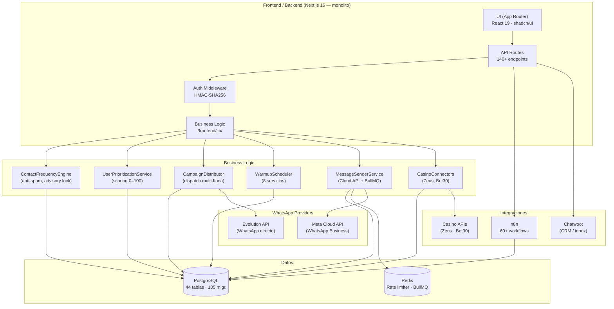

# Documento de Handover Técnico — WA Platform

**Versión:** 1.0  
**Fecha:** 2026-05-31  
**Preparado para:** [PENDIENTE - COMPLETAR POR EQUIPO]  
**Proyecto:** WhatsApp Automation Platform para iGaming LATAM

---

## 1. Resumen Ejecutivo

Esta plataforma es un sistema de automatización de WhatsApp para operadores de iGaming (casinos) en LATAM, diseñado para **retención y reactivación de jugadores** con protección activa contra el ban de líneas.

El sistema toma datos de jugadores de los casinos (Zeus, Bet30), los segmenta por valor de vida (Super Vip/Vip/Medio/Bajo) y días de inactividad, calcula un score de prioridad para cada uno, y gestiona el despacho de mensajes a través de múltiples líneas WhatsApp con controles estrictos de frecuencia y anti-ban.

**Stack principal:** Next.js 16 (App Router, monolito full-stack) · PostgreSQL (SQL crudo, sin ORM) · Redis · Evolution API · Meta WhatsApp Cloud API · n8n · Chatwoot

**Escala actual:** 30+ líneas WhatsApp · 105 migraciones de DB · 140+ API routes · 60+ workflows n8n

**Decisión arquitectónica principal:** El sistema vive en un **monolito Next.js** — las API routes son el backend. No hay servidor separado. Esta fue una decisión deliberada para reducir fricción operativa y simplificar el deploy, a costa de mezclar lógica de presentación y negocio en el mismo proceso.

---

## 2. Contexto de Negocio y Reglas Operativas Críticas

### 2.1 El problema que resuelve

Los casinos de iGaming tienen un churn altísimo. Un jugador que depositó hace 14 días y no volvió es una pérdida de LTV. El sistema automatiza el contacto proactivo por WhatsApp con el objetivo de reactivar jugadores antes de que se consideren perdidos definitivamente.

El vector de comunicación es WhatsApp personal (no notificaciones de app, no email): esto es más efectivo pero también más invasivo y susceptible de generar bans si se usa incorrectamente.

### 2.2 Reglas de segmentación (Manual de Retención)

El sistema clasifica a cada jugador en un **tier de valor** basado en su historial de depósitos:

| Tier | Criterio monetario | Score de valor |
|------|-------------------|----------------|
| **Super Vip** (`super_vip`) | Depósito total ≥ $10,000 | 60 pts |
| **Vip** (`vip`) | Depósito total ≥ $3,000 | 45 pts |
| **Medio** (`medio`) | Depósito total ≥ $500 | 25 pts |
| **Bajo** (`bajo`) | Depósito total < $500 | 10 pts |

Cada tier tiene una **ventana de inactividad** que define cuándo tiene sentido contactar a un jugador:

| Tier | Min días inactivo | Max días inactivo | Lógica |
|------|------------------|------------------|--------|
| Super Vip | 7 | 180 (6 meses) | LTV alto justifica mantener el intento hasta 6 meses |
| Vip | 7 | 150 (5 meses) | Similar a Super Vip pero ventana algo más corta |
| Medio | 14 | 60 (2 meses) | Ventana mediana, ROI positivo hasta ~2 meses |
| Bajo | 30 | 45 | Ventana muy estrecha — fuera de ella el ROI es negativo |

Contactar a alguien fuera de su ventana (muy activo o demasiado frío) tiene ROI negativo y potencial de generar opt-outs.

### 2.3 Sistema de scoring y urgencia

Dentro de la ventana de su tier, cada jugador tiene un **score de urgencia (0–40)** que decae linealmente desde que entra en la ventana hasta que la abandona. La lógica es: un jugador recién inactivo tiene mayor memoria de marca y mayor probabilidad de retorno.

```
Priority Score (0–100) = Value Score (0–60) + Urgency Score (0–40)

Urgency(días, tier) = (1 − posición_en_ventana) × 40
```

Un Super Vip al final de su ventana (score=60+0=60) siempre supera a un Bajo al inicio (10+40=50). Esto es intencional: nunca se sacrifica un Super Vip por un Bajo.

### 2.4 Segmentos de difusión

Los jugadores elegibles se clasifican en segmentos que indican el tipo de mensaje/incentivo que corresponde:

| Segmento | Tiers | Días inactivo | Mensaje recomendado |
|----------|-------|---------------|---------------------|
| `REACTIVACION_URGENTE` | Super Vip, Vip | 7–30d | Mensaje directo: "Te extrañamos, volvé" |
| `REACTIVACION_PRIORITARIA` | Super Vip, Vip 31–90d · Medio 14–30d | — | Con incentivo: bono, free spins, cashback |
| `REACTIVACION_ESTANDAR` | Super Vip, Vip 91–120d · Medio 31–60d | — | Oferta especial, torneo, novedad |
| `REACTIVACION_FRIA_ALTO_VALOR` | Super Vip 121–180d · Vip 121–150d | — | Win-back agresivo: oferta máxima |
| `REACTIVACION_FRIA` | Bajo | 30–45d | Mensaje de bajo costo, sin incentivo grande |

**Regla crítica:** nunca enviar un mensaje de `REACTIVACION_URGENTE` a un jugador `FRIA` ni al revés. El mensaje debe corresponder al segmento.

### 2.5 Filtros de NO CONTACTO (reglas de exclusión)

Antes de cualquier envío, el sistema aplica filtros de exclusión:

1. **Blacklist** — número en tabla `blacklist` → skip permanente
2. **Opt-out** — número en `cloud_opt_outs` (para Cloud API) → skip permanente
3. **Frecuencia por contacto** — `ContactFrequencyEngine` evalúa si el contacto recibió demasiados mensajes en ventana diaria/semanal (ver §7)
4. **Fuera de ventana** — contacto no elegible según su tier (no en `contact_priority_scores`)
5. **Línea no disponible** — `status ≠ 'active'` o `is_connected = false` o límites de rate excedidos

El `pause_reason` de una campaña registra por qué se pausó automáticamente (sin líneas disponibles, frecuencia excedida, etc.).

### 2.6 Reglas anti-ban (críticas)

WhatsApp bane líneas por comportamiento masivo/spam. Las reglas de protección son:

- **Delays humanizados** entre mensajes (perfiles `anti_ban_profiles` con min/max ms)
- **Rate limits por línea**: `msg_per_hour` y `msg_per_day` configurables por línea
- **Rotación de líneas**: el distributor elija la línea con menor carga, no siempre la misma
- **Warmup gradual**: líneas nuevas pasan por fases de warmup antes de entrar a campañas
- **Proxies dedicados** por línea (`proxies` + `line_proxy_assignment_log`)
- **Personalización de nombre**: campaña con `personalize_name=true` usa el nombre del contacto
- **`pg_advisory_xact_lock`**: previene que el mismo número reciba duplicados desde 2 líneas paralelas

**⚠️ NUNCA eliminar delays, ignorar rate limits ni saltar la evaluación del ContactFrequencyEngine. Un ban de línea es una pérdida operativa real y tarda días en recuperarse.**

---

## 3. Arquitectura General y Decisiones Clave

### 3.1 Diagrama de arquitectura



### 3.2 Decisiones de arquitectura y por qué

| Decisión | Por qué | Trade-off |
|----------|---------|-----------|
| **Monolito Next.js** (no microservicios) | Deploy simple, un solo proceso, Railway-friendly. Estado del proyecto early-stage no justificaba complejidad distribuida. | Lógica de negocio mezclada con API routes; escalar selectivamente es difícil |
| **SQL crudo con `pg` (sin ORM)** | Queries complejas de casino/scoring se benefician del control total. Evita el overhead de Prisma/Drizzle en un modelo que evoluciona constantemente. | Más verboso, sin type-safety automático en queries |
| **`pg_advisory_xact_lock` en FrequencyEngine** | Con 30 líneas en paralelo, la evaluación de frecuencia tenía race condition TOCTOU. El lock serializa evaluaciones del mismo contacto sin serializar todo el sistema. | Leve latencia extra por serialización; duración < 50ms por lock |
| **`FOR UPDATE SKIP LOCKED` en campaign_recipients** | Permite que múltiples workers tomen units sin bloqueos muertos. Cada línea "clama" su propio recipient sin esperar a las demás. | Solo funciona bien si hay suficientes recipients en estado `pending` |
| **BullMQ + Redis para Cloud API** | Los mensajes de Cloud API son asíncronos (Meta puede demorar el delivery). Una queue con retry exponencial es más confiable que fire-and-forget. | Requiere Redis corriendo; el worker necesita restart independiente |
| **RBAC jerárquico (admin/operator/viewer + sectors)** | Los operadores deben ver solo sus contactos y líneas. Granularidad necesaria para multi-tenancy ligero. | Sin RLS de PostgreSQL a nivel de fila para operadores (solo JS-level checks) |
| **Numbers dedicados (1 número = 1 instancia Evolution)** | Aísla el riesgo de ban: si una línea es baneada, el resto continúa. Permite warmup gradual por línea. | Costo operativo de mantener múltiples instancias |

### 3.3 Patrón de API route

Cada API route sigue este patrón:

```typescript
// 1. Verificar permisos
const auth = await checkPermissionWithUser(req, 'campaigns', 'read')
if (!auth.ok) return auth.response
const { user } = auth   // rol y sectors frescos de DB (no del token)

// 2. Validar input (Zod)
const body = schema.parse(await req.json())

// 3. Query SQL crudo
const result = await query('SELECT ... WHERE operator_id = $1', [user.id])

// 4. Retornar JSON
return NextResponse.json(result.rows)
```

---

## 4. Estado Actual del Proyecto

### 4.1 Estado de features principales

| Feature | Estado | Notas |
|---------|--------|-------|
| Campaign dispatch (Evolution API) | ✅ Producción | Multi-línea, retry, durabilidad, lock |
| Campaign dispatch (Cloud API) | ✅ Producción | BullMQ + Meta Graph API |
| RBAC (roles + sectors + line grants) | ✅ Producción | 3 roles, 16 recursos |
| Scoring de priorización (0–100) | ✅ Implementado | `UserPrioritizationService` en `/lib/user-prioritization/` |
| UI de prioridades (`/prioridades`) | ✅ Implementado | Tabla con score breakdown + segmentos |
| ContactFrequencyEngine | ✅ Implementado | Motor completo con advisory lock en `/lib/contact-frequency/` |
| **Integración FrequencyEngine → campaign-distributor** | ⚠️ **PENDIENTE** | El motor existe pero `atomicEvaluateAndRecord()` no está wired en `sendOneUnit()`. Ver comentario al final de `ContactFrequencyEngine.ts` |
| Settings Refactor — Fase 0 (tablas DB) | ✅ Producción | `segmentation_tiers`, `scoring_config`, `settings_audit_log` (migraciones 103–105) |
| Settings Refactor — Fase 1 (UI de lectura) | ✅ Producción | UI muestra tiers y scoring config |
| Settings Refactor — Fase 2 (PATCH + validación) | ⚠️ **PENDIENTE** | UI de edición de tiers/scoring no implementada |
| Warmup scheduler | ✅ Producción | 8 servicios, phases, health score, alerts |
| Casino connector (Zeus) | ✅ Producción | Sync incremental |
| Casino connector (Bet30) | ✅ Producción | Hereda de Zeus (mismo API, diferente URL) |
| Chatwoot integration | ✅ Producción | Conversaciones, inbox, notas |
| Cloud API onboarding (Embedded Signup) | ✅ Implementado | Meta OTP flow |
| Blacklist / opt-out | ✅ Producción | Tabla `blacklist` + `cloud_opt_outs` |
| Prospects (pre-contactos) | ✅ Producción | Import, listas, conversión a contact |
| Automations engine | ✅ Implementado | Triggers, rules, logs |
| Estadísticas + Claude AI usage | ✅ Implementado | `/estadisticas`, incluyendo `/api/stats/ai` |
| RLS en todas las tablas | ✅ Producción | Migraciones 032 + 094: RLS activado sin policies (bloquea anon key) |

### 4.2 Trabajo inmediato recomendado

1. **Wiring del ContactFrequencyEngine en `campaign-distributor.ts`** — el código de integración ya está documentado al pie de `ContactFrequencyEngine.ts`. Es la tarea de mayor impacto operativo pendiente.
2. **Settings Fase 2** — UI de edición de `segmentation_tiers` y `scoring_config` via PATCH endpoints.
3. **Calibración de umbrales** — Los valores en `config.ts` están marcados `[CALIBRAR]` y necesitan ajuste con datos reales de conversión.

---

## 5. Estructura del Código y Módulos Principales

### 5.1 Árbol de directorios raíz

```
whatsapp-automation-platform/
├── db/
│   ├── migrations/          # 105 migraciones SQL (fuente de verdad del schema)
│   └── schema/init.sql      # DDL baseline (referencia, no usar para migrar)
├── docs/                    # Documentación técnica (architecture, runbooks, security)
├── frontend/                # Aplicación Next.js 16 — TODO vive aquí
│   ├── app/
│   │   ├── (protected)/     # 21 rutas autenticadas
│   │   ├── api/             # 140+ API routes (backend)
│   │   └── login/
│   ├── components/          # Componentes React (shadcn/ui + custom)
│   ├── hooks/               # Custom React hooks
│   └── lib/                 # Lógica de negocio, servicios, helpers
├── n8n/                     # Templates de workflows y credenciales
├── scripts/
│   ├── ops/                 # run-migrations, create-admin, etc.
│   └── workers/             # cloud-message-worker.ts (BullMQ)
├── src/                     # Casino connectors legacy (Zeus, Bet30)
│   └── casino-connectors/
└── workflows/               # JSON exports de workflows n8n
```

### 5.2 Módulos principales en `/frontend/lib/`

| Módulo | Path | Responsabilidad |
|--------|------|----------------|
| `ContactFrequencyEngine` | `lib/contact-frequency/` | Decide si se puede enviar a un contacto (ALLOW/DELAY/BLOCK) con advisory lock para atomicidad |
| `UserPrioritizationService` | `lib/user-prioritization/` | Calcula score 0–100 por contacto y segmento de difusión |
| `CampaignDistributor` | `lib/campaign-distributor.ts` | Dispatch multi-línea con `FOR UPDATE SKIP LOCKED`, retry, durabilidad |
| `WarmupScheduler` | `lib/services/warming/` | 8 servicios de warmup: orchestrator, phase-manager, health-scorer, alert-engine, etc. |
| `MessageSenderService` | `lib/cloud-api/infrastructure/message-sender.service.ts` | Envío por Meta Cloud API con rate limiter Redis |
| `CasinoConnectors` | `src/casino-connectors/` | Zeus y Bet30: fetchTransactions, normalizeTransactions, healthCheck |
| `RBAC / permissions` | `lib/permissions.ts` | canAccess(), checkPermissionWithUser(), isOwnerOrAdmin() |
| `scoring-config-service` | `lib/scoring-config-service.ts` | Caché Redis de `scoring_config` DB |
| `db` | `lib/db.ts` | Pool PostgreSQL + `withTransaction()` |

### 5.3 Páginas protegidas (`/app/(protected)/`)

| Ruta | Propósito |
|------|-----------|
| `/` (dashboard) | KPIs, métricas de casino |
| `/campaigns` | CRUD de campañas + dispatch |
| `/contacts` | Base de datos de jugadores + import |
| `/conversations` | Inbox de conversaciones |
| `/lines` | Gestión de líneas WhatsApp (QR, health) |
| `/warmup` | Warmup scheduler |
| `/templates` | WhatsApp templates (Meta) |
| `/lists` | Listas de contactos |
| `/prioridades` | Tabla de priorización con scores |
| `/settings` | Frequency rules, scoring config, segmentation tiers |
| `/users` | CRUD usuarios con RBAC + sectors |
| `/estadisticas` | Reporting y analytics |
| `/tasks` / `/mis-tareas` / `/tareas` | Gestión de tareas |
| `/blacklist` | Blacklist |
| `/automatizaciones` | Motor de automatizaciones |

---

## 6. Base de Datos y Esquema

### 6.1 Convenciones importantes

- **Sin ORM**: todo es SQL crudo con el driver `pg`. Queries en los API routes o en los services de `/lib/`.
- **Migraciones**: archivos en `db/migrations/` numerados secuencialmente. Ejecutar con `node scripts/ops/run-migrations.mjs`.
- **Columnas `deleted_at`**: soft delete en `tasks`. La mayoría de tablas no tienen soft delete — un DELETE es permanente.
- **`owned_by`**: FK a `users.id` en campaigns, contact_lists, prospects. Determina ownership para RBAC.
- **`pause_reason`**: texto libre en `campaigns` que registra por qué se pausó. Seteado en todos los puntos de pausa del distributor.

### 6.2 Tablas principales por dominio

**Identidad y RBAC**
```sql
users (id, email, password_hash, role, sectors[], permissions JSONB, session_version)
line_grants (id, line_id, user_id)       -- qué líneas puede ver cada operador
```

**Contactos**
```sql
contacts (
  id, phone_number UNIQUE, first_name, last_name,
  linea INT,                             -- número de línea asignada (1–100)
  platforms JSONB,                       -- { zeus: {...}, bet30: {...} }
  segment,                               -- super_vip/vip/medio/bajo
  last_contacted_at, created_at
)
contact_lists (id, name, owned_by, source, contact_count)
contact_list_members (contact_id, list_id)
contact_tags (id, contact_id, tag_name)
```

**Campañas (núcleo del dispatch)**
```sql
campaigns (
  id, name, message, messages[],         -- multi-mensaje
  status,                                -- draft/active/paused/completed
  owned_by,
  list_id, prospect_list_id,
  pause_reason,                          -- por qué se pausó (migración 054)
  total_recipients, sent, failed, skipped
)

campaign_recipients (
  id, campaign_id,
  contact_id,                            -- NULL si es prospect
  prospect_id,                           -- NULL si es contact
  phone_number,
  status,                                -- pending→sending→sent|failed|skipped
  line_id,
  attempts (0–3),
  processor_lock_token,
  processor_locked_at
)
```

**Control de frecuencia**
```sql
contact_frequency_rules (
  id, operator_id, seg_monto, seg_actividad,
  scope_key,                             -- namespace de la regla
  max_per_day, max_per_week, min_hours_between_sends,
  is_active
)

contact_send_history (
  id, contact_id, campaign_id, operator_id,
  phone_number,
  campaign_recipient_id UNIQUE,          -- idempotencia: no duplicar registros
  sent_at
)
```

**Scoring**
```sql
contact_priority_scores (
  id, contact_id, operator_id, run_id,
  overall_score,                         -- 0–100
  value_score,                           -- 0–60
  urgency_score,                         -- 0–40
  segment,                               -- REACTIVACION_URGENTE | ... | null
  broadcasted,                           -- marcado cuando se incluyó en difusión
  created_at
)

segmentation_tiers (
  tier,                                  -- super_vip/vip/medio/bajo
  min_days_inactive, max_days_inactive,
  value_score, deposit_threshold_min,
  recontact_cooldown_days
)

scoring_config (key, value)              -- constantes: allow_threshold, delay_threshold, etc.
```

**Casino**
```sql
casino_players (id, username, platform, agent, last_login, total_deposit, segment)
casino_transactions (id, platform, username, transaction_type, amount, created_at)
```

**Cloud API (Meta)**
```sql
cloud_numbers (id, phone_number_id, phone_number, status, wa_id)
cloud_messages (id, conversation_id, direction, status, message_type, content)
cloud_opt_outs (phone_number, opted_out_at)   -- opt-outs explícitos (STOP keyword)
```

**Auditoría**
```sql
settings_audit_log (id, setting_key, old_value, new_value, changed_by, changed_at)
-- Trigger automático en tablas de configuración crítica (migración 105)
```

### 6.3 Notas sobre RLS

La estrategia deliberada es: **RLS activado en todas las tablas, sin policies**. Esto significa:
- La `anon key` de Supabase queda **completamente bloqueada** (no puede leer nada)
- El backend usa **conexión directa a PostgreSQL** (user con `BYPASSRLS` o equivalente) — no usa Supabase JS client para queries de negocio
- La autorización se hace en la capa de aplicación (RBAC en los API routes)

Migraciones relevantes: **032** (tablas originales) + **094** (tablas nuevas post-032) + **095** (fix de funciones SECURITY DEFINER).

---

## 7. Lógica de Negocio Principal (Segmentación, Scoring y Frecuencia)

### 7.1 Pipeline completo de una campaña de reactivación

```
1. IMPORT DE DATOS DE CASINO
   CasinoConnector.fetchTransactions()
   → casino_players, casino_transactions actualizados

2. CÁLCULO DE SCORES
   UserPrioritizationService.computeForAll()
   → SELECT contacts JOIN casino_players
   → computeScore(daysInactive, segment, totalDeposit)
   → UPSERT contact_priority_scores (overall, value, urgency, segment)
   Trigger: POST /api/contacts/recompute-priorities (admin only)

3. SELECCIÓN DE DESTINATARIOS
   Operador filtra por segmento de difusión en /prioridades
   → Crea contact_list con los contactos seleccionados
   → Crea campaign con esa lista

4. DISPATCH (CampaignDistributor)
   Por cada campaign_recipient en estado 'pending':
   a. claimNextUnit() — SELECT ... FOR UPDATE SKIP LOCKED → asigna line_id
   b. checkBlacklist() → skip si está en blacklist
   c. checkOptOut() → skip si está en cloud_opt_outs
   d. ContactFrequencyEngine.atomicEvaluateAndRecord() [⚠️ PENDIENTE INTEGRACIÓN]
      → pg_advisory_xact_lock serializa evaluaciones paralelas del mismo contacto
      → ALLOW → continuar
      → DELAY → postponer (calcular retry_after)
      → BLOCK → skip y loguear
   e. Envío:
      - Evolution: POST {evolution_url}/message/sendText/{instance}
      - Cloud: MessageSenderService → BullMQ → Meta Graph API
   f. UPDATE campaign_recipients SET status='sent'
   g. UPDATE whatsapp_lines SET msgs_sent_hour += 1, msgs_sent_today += 1
```

### 7.2 ContactFrequencyEngine — detalle de implementación

**Archivo:** `frontend/lib/contact-frequency/ContactFrequencyEngine.ts`

El motor resuelve la **race condition TOCTOU** que ocurre cuando 30 líneas evalúan el mismo contacto en paralelo:

```
Problema sin lock:
  Línea A: evaluate(contactX) → count=0 → ALLOW
  Línea B: evaluate(contactX) → count=0 → ALLOW (simultáneo!)
  Línea A: recordSend() → count=1
  Línea B: recordSend() → count=2 ← viola max_per_day=1

Solución con advisory lock:
  Línea A: pg_advisory_xact_lock(50, hash("contactX")) → adquiere lock
  Línea A: lee count=0 → ALLOW → INSERT en contact_send_history (dentro de txn)
  Línea A: COMMIT → libera lock → count=1 en DB
  Línea B: adquiere lock (antes esperaba) → lee count=1 → BLOCK ✓
```

**Método recomendado:** `atomicEvaluateAndRecord()` — evaluación + registro en una sola transacción.

**Risk Score (0–100):**
```
Risk = (daily_weight × daily_usage_ratio)
     + (weekly_weight × weekly_usage_ratio)  
     + (cooldown_weight × cooldown_pressure)

Pesos por defecto: daily=40, weekly=35, cooldown=25
```

**Umbrales de decisión (configurables en `scoring_config`):**
- Risk ≤ `allow_threshold` (default 30) → **ALLOW**
- 30 < Risk ≤ `delay_threshold` (default 60) → **DELAY**
- Risk > 60 → **BLOCK**

**⚠️ TAREA PENDIENTE:** La integración de `atomicEvaluateAndRecord()` en `campaign-distributor.ts` no está hecha. El motor existe y funciona en tests, pero el distributor actual no lo llama. Las instrucciones exactas de integración están documentadas al final de `ContactFrequencyEngine.ts` (líneas 315–363).

### 7.3 UserPrioritizationService — detalle

**Archivo:** `frontend/lib/user-prioritization/UserPrioritizationService.ts`

```typescript
// Entrada
{
  daysInactive: number,
  segment: 'super_vip' | 'vip' | 'medio' | 'bajo' | null,
  totalDepositAmount: number | null
}

// Salida
{
  valueScore: 0–60,     // constante por tier
  urgencyScore: 0–40,   // decae linealmente dentro de la ventana
  total: 0–100,
  valueTier: ValueTier,
  reactivationSegment: 'REACTIVACION_URGENTE' | ... | null
}
```

**Prioridad de resolución del tier:**
1. `totalDepositAmount` (monetario exacto) — usa `DEPOSIT_AMOUNT_TIERS`
2. `segment` declarado por el casino (proxy calculado)
3. Fallback `'bajo'` si todo es null

**Configuración en código** (`lib/user-prioritization/config.ts`): Los valores `[DB-READY]` son candidatos para migrar a `segmentation_tiers` y `scoring_config` en DB, permitiendo ajuste sin deploy. Los `[CALIBRAR]` requieren datos reales de conversión antes de modificar.

### 7.4 Resolución de regla de frecuencia

El motor busca la regla más específica disponible para el contexto del contacto:

| Especificidad (mayor a menor) | Campos |
|-------------------------------|--------|
| 7 | operator_id + seg_monto + seg_actividad |
| 6 | operator_id + seg_monto |
| 5 | operator_id + seg_actividad |
| 4 | operator_id only |
| 1–3 | global (sin operator_id) |
| 0 | fallback hardcoded |

Si no existe ninguna regla, se usa un fallback conservador (max 1/día, 3/semana, 24h entre envíos).

---

## 8. Seguridad, Cumplimiento y Controles Críticos

### 8.1 Autenticación

- **Sesiones HMAC-SHA256**: no JWT, no Supabase Auth. Cookie `session` firmada con `AUTH_SECRET`.
- `session_version` en la tabla `users`: invalidar todas las sesiones activas de un usuario incrementando este campo.
- Middleware Next.js verifica la sesión en cada request a rutas protegidas.
- Los roles/sectors se leen frescos de DB en cada request (no del token) — cambios de permisos toman efecto inmediato.

### 8.2 Autorización (RBAC)

```
admin   → acceso total
operator → read + create + update + send (solo en sus sectors y líneas asignadas)
viewer   → read only (solo en sus sectors)
```

**Ownership**: recursos con `owned_by` solo pueden ser modificados por su dueño o por admin. Implementado en `isOwnerOrAdmin()`.

**Line grants**: los operadores solo ven/usan las líneas en su `line_grants`. Esto es crítico para multi-tenancy: dos operadores de distintos clientes no deben ver las líneas del otro.

### 8.3 Cifrado de tokens

Los tokens de Evolution API y Meta Cloud API se almacenan **cifrados con AES-256** via `pgcrypto` (migración 070). La clave de cifrado es `TOKEN_ENCRYPTION_KEY` (en variables de entorno). Nunca almacenar tokens en texto plano en la DB.

### 8.4 RLS (Row Level Security)

Todas las tablas tienen RLS habilitado (migraciones 032 + 094). Sin policies → bloqueo total de la `anon key` de Supabase. El backend usa conexión directa a PostgreSQL con usuario privilegiado.

**⚠️ No usar Supabase JS client para queries de negocio.** Solo usar el pool `pg` directo (`lib/db.ts`).

### 8.5 Manejo de PII

- Números de teléfono son PII. No loguear números en texto plano en producción.
- `cloud_opt_outs`: opt-out explícito del contacto. Nunca contactar un número que esté aquí.
- `blacklist`: bloqueo operacional. Diferente al opt-out (uno es del usuario, el otro es operacional).
- `conversation_notes`: notas de agentes sobre conversaciones — pueden contener PII. Acceso solo con permisos de `conversations`.

### 8.6 Audit trail

- `settings_audit_log`: trigger automático en tablas de configuración crítica (scoring_config, segmentation_tiers). Registra old_value, new_value, changed_by, changed_at.
- Para auditoría de mensajes enviados: `whatsapp_messages` + `contact_send_history`.
- Para auditoría de imports: `import_logs`.

### 8.7 Opt-out y cumplimiento

- **STOP keywords**: tabla `cloud_stop_keywords`. Cuando un contacto responde con una keyword de stop, se agrega automáticamente a `cloud_opt_outs`.
- **Consent log**: `cloud_consent_log` registra consentimientos de contactos para comunicaciones.
- **⚠️ Siempre respetar opt-outs.** El sistema los chequea antes de cada envío.

---

## 9. Integraciones Externas

### 9.1 Evolution API (WhatsApp directo)

**Propósito:** Enviar mensajes de WhatsApp usando instancias "no-official" (para líneas no-Business).

**Endpoints críticos:**
```
POST {evolution_url}/message/sendText/{instance}
POST {evolution_url}/message/sendMedia/{instance}
GET  {evolution_url}/instance/connectionState/{instance}
```

**Configuración:** Cada línea en `whatsapp_lines` tiene `evolution_instance` y `evolution_url`. La `api_key` está cifrada en DB.

**Webhook:** `POST /api/webhook/evolution` — recibe status de delivery y mensajes inbound.

**Mapeo de líneas a agentes (casino):**
| Línea key | Agente casino |
|-----------|--------------|
| btcuno | betcoin |
| btcdos | farabet |
| ofizeus | zeus |
| royal | zeusroyal |

### 9.2 Meta WhatsApp Cloud API

**Propósito:** Canal oficial de WhatsApp Business (para números registrados con Meta).

**Flujo de onboarding:** Embedded Signup Meta → OTP → registro número en `cloud_numbers`.

**Endpoints críticos:**
```
POST /{version}/{phone_number_id}/messages    — enviar
POST /api/cloud/webhook                       — recibir (inbound + delivery status)
```

**Rate limiter:** Token bucket en Redis — 20 mensajes/segundo por número. Implementado en `lib/cloud-api/rate-limiter.ts`.

**Queue BullMQ:** Envío asíncrono desde `lib/cloud-api/message-queue.ts`. Worker en `scripts/workers/cloud-message-worker.ts` (5 workers concurrentes, retry exponencial).

**Variables requeridas:** `META_APP_ID`, `META_APP_SECRET`, `META_WEBHOOK_VERIFY_TOKEN`, `TOKEN_ENCRYPTION_KEY`, `NEXT_PUBLIC_META_APP_ID`, `NEXT_PUBLIC_META_CONFIG_ID`.

### 9.3 n8n (orquestador de workflows)

**Propósito:** Cron jobs, resets, reportes, sincronización de datos.

**Workflows clave:**
| ID | Función |
|----|---------|
| WF-007 | Campaign dispatch orchestrator |
| WF-012 | Line selection & rate limiting |
| WF-013 | Warmup scheduler |
| WF-016 | Daily metrics reset (contadores de línea) |
| WF-017 | Reporting y alertas |

**Integración:** Los workflows leen y escriben directamente en PostgreSQL. También llaman API routes via HTTP.

**[PENDIENTE - COMPLETAR POR EQUIPO]** Estado actual de cada workflow activo en producción.

### 9.4 Chatwoot (CRM / inbox)

**Propósito:** UI de bandeja de entrada para conversaciones y gestión de agentes.

**Integración:** Los mensajes inbound llegan via webhook de Evolution/Meta → se crean conversaciones en Chatwoot via API. Los agentes responden desde Chatwoot → la respuesta llega al backend via webhook de Chatwoot.

**Variables:** `CHATWOOT_API_URL`, `CHATWOOT_API_KEY`, `CHATWOOT_ACCOUNT_ID`.

### 9.5 Casino APIs (Zeus, Bet30)

**Propósito:** Obtener historial de transacciones de jugadores para segmentación.

**Patrón:** Factory pattern con `BaseCasinoConnector` → `ZeusConnector` → `Bet30Connector` (hereda Zeus).

**Sync:** Script `scripts/sync-casino-players-live.js` hace sync incremental. También disponible via n8n.

**[PENDIENTE - COMPLETAR POR EQUIPO]** Credenciales y URLs de los casinos cliente.

### 9.6 Redis

**Usos:**
1. **Rate limiter Cloud API** (Token Bucket, 20 msg/s por número)
2. **BullMQ message queue** (`cloud-messages`, 5 workers, DLQ: `cloud-messages-dlq`)
3. **Caché de scoring_config** (para no leer DB en cada evaluación de frecuencia)

**Variable:** `REDIS_URL`.

---

## 10. Despliegue, Entorno y Operaciones

### 10.1 Variables de entorno requeridas

```bash
# Auth
AUTH_SECRET=           # openssl rand -hex 32 — firma de sesiones
AUTH_USERNAME=         # email admin inicial
AUTH_PASSWORD=         # contraseña admin inicial

# PostgreSQL
DB_HOST=
DB_PORT=5432
DB_NAME=
DB_USER=
DB_PASSWORD=
DB_POOL_MAX=5
DB_SSL=true

# Redis
REDIS_URL=

# Evolution API
EVOLUTION_URL=
EVOLUTION_API_KEY=
EVOLUTION_GLOBAL_API_KEY=
EVOLUTION_WEBHOOK_SECRET=

# Meta Cloud API
META_APP_ID=
META_APP_SECRET=
META_WEBHOOK_VERIFY_TOKEN=
TOKEN_ENCRYPTION_KEY=   # AES-256 para tokens en DB — openssl rand -hex 32
NEXT_PUBLIC_META_APP_ID=
NEXT_PUBLIC_META_CONFIG_ID=

# Casino APIs
ZEUS_API_KEY=
ZEUS_PLAYER_TOKEN=
ZEUS_API_BASE=
BET30_API_KEY=
BET30_PLAYER_TOKEN=
BET30_API_BASE=

# n8n
N8N_URL=
N8N_LOCAL_API_KEY=

# Chatwoot
CHATWOOT_API_URL=
CHATWOOT_API_KEY=
CHATWOOT_ACCOUNT_ID=

# Supabase (solo para backups/auth extra, no para queries de negocio)
SUPABASE_URL=
SUPABASE_KEY=
```

**[PENDIENTE - COMPLETAR POR EQUIPO]** Valores reales de producción (no commitear al repo).

### 10.2 Setup inicial

```bash
# 1. Instalar dependencias
cd frontend && npm install

# 2. Ejecutar todas las migraciones
node scripts/ops/run-migrations.mjs

# 3. Crear usuario admin inicial
node scripts/ops/create-admin-user.mjs

# 4. Iniciar app
cd frontend && npm run dev       # desarrollo
cd frontend && npm run build && npm start  # producción

# 5. Iniciar worker BullMQ (Cloud API)
npx ts-node scripts/workers/cloud-message-worker.ts
```

### 10.3 Gestión de migraciones

```bash
# Ejecutar migraciones nuevas
node scripts/ops/run-migrations.mjs

# Las migraciones son idempotentes: verifican si ya se ejecutaron antes
# NUNCA editar una migración ya ejecutada en producción — crear una nueva
```

### 10.4 Despliegue en Railway

El proyecto está configurado para Railway. Ver `docs/deployment.md` para el checklist completo.

**Proceso de deploy:**
1. Push a `main`
2. Railway detecta cambios, construye Next.js
3. **Ejecutar manualmente** `POST /api/admin/migrate` (admin only) para correr migraciones nuevas
4. Reiniciar worker BullMQ si hay cambios en `scripts/workers/`

### 10.5 Operaciones cotidianas

| Tarea | Cómo |
|-------|------|
| Resetear contadores de línea (hourly/daily) | Automático via n8n WF-016 |
| Sincronizar jugadores casino | `POST /api/casino/sync` o n8n WF |
| Recalcular priority scores | `POST /api/contacts/recompute-priorities` |
| Resolver lock de campaign stuck | `POST /api/campaigns/{id}/force-unlock` |
| Retry de recipients fallidos | `POST /api/campaigns/{id}/retry-failed` |
| Ver líneas en mal estado | `GET /api/lines/health` |
| Ver alertas de warmup | `GET /api/warmup/alerts` |

---

## 11. Deuda Técnica, Riesgos y Puntos de Atención

### 11.1 Deuda técnica activa

| Item | Severidad | Descripción |
|------|-----------|-------------|
| FrequencyEngine no integrado | **Alta** | `ContactFrequencyEngine.atomicEvaluateAndRecord()` existe pero no está wired en `campaign-distributor.ts`. Sin esto, el sistema puede enviar duplicados en entornos multi-línea. |
| Settings Fase 2 pendiente | Media | La UI de edición de `segmentation_tiers` y `scoring_config` no está implementada. Los admins no pueden ajustar umbrales sin modificar código. |
| Valores de scoring no calibrados | Media | `config.ts` tiene valores marcados `[CALIBRAR]` que son estimaciones. Requieren datos reales de conversión para optimizar ROI. |
| Sin type-safety en queries SQL | Media | Las queries SQL crudo no tienen type-checking. Errores en nombres de columna solo se detectan en runtime. Candidato a migrar a Drizzle o Kysely en el futuro. |
| RBAC solo en capa de aplicación | Media | La autorización se hace en JS, no en PostgreSQL. Un bug en un API route podría exponer datos de otro operador. |
| Worker BullMQ requiere proceso separado | Baja | El worker de Cloud API no está integrado en el proceso Next.js — requiere restart separado en deploys. |
| Tests de cobertura baja | Baja | Los tests existentes cubren principalmente el módulo de frecuencia. El distributor y los conectores de casino tienen cobertura baja. |

### 11.2 Riesgos operativos

| Riesgo | Probabilidad | Impacto | Mitigación |
|--------|-------------|---------|------------|
| Ban de línea WhatsApp | Media | Alto | Warmup gradual, rate limits, delays humanizados, proxies dedicados. NO tocar estas configuraciones sin entender el impacto. |
| Duplicación de mensajes (TOCTOU) | Media (sin fix de FrequencyEngine) | Medio | Integrar `atomicEvaluateAndRecord()` — ver §7.2 |
| Pérdida de conexión de línea | Alta (frecuente) | Medio | El sistema detecta `is_connected=false` y pausa la campaña. Re-vincular via `/lines` + QR. |
| Saturación de Redis | Baja | Alto | El rate limiter y BullMQ dependen de Redis. Si cae, la Cloud API se detiene. Monitorear memoria. |
| Migración fallida en producción | Baja | Alto | Las migraciones son irreversibles (DROP no está en ninguna). Revisar en staging antes de producción. |
| Cambio de API de casinos | Media | Alto | Los conectores tienen `healthCheck()`. Si Zeus o Bet30 cambia su API, la sync falla silenciosamente. |

### 11.3 Puntos que suelen confundir

- **`campaigns.message` vs `campaigns.messages[]`**: el campo singular es legacy. Campañas nuevas usan el array multi-mensaje. Ambos coexisten.
- **`contact_id` nullable en `campaign_recipients`**: si la campaña es para prospects, `contact_id` es NULL y se usa `prospect_id`.
- **Diferencia `blacklist` vs `cloud_opt_outs`**: blacklist es operacional (el agente bloquea), opt-out es del usuario (respondió STOP). Ambos bloquean envíos pero con semántica diferente.
- **`session_version` en users**: invalidar sesiones de un usuario = `UPDATE users SET session_version = session_version + 1`. Las sesiones existentes del token anterior quedan inválidas en el próximo request.
- **Test environment**: los tests con cookies necesitan `// @vitest-environment node` al tope del archivo. `happy-dom` elimina los headers de Cookie y los tests de RBAC fallan.

---

## 12. Checklist de Onboarding para el Nuevo Desarrollador

### Semana 1 — Lectura y comprensión

- [ ] Leer este documento completo
- [ ] Leer `docs/environment.md` y configurar variables de entorno locales
- [ ] Ejecutar migraciones y levantar el proyecto localmente (`npm run dev`)
- [ ] Explorar el código de `ContactFrequencyEngine.ts` — es el módulo más crítico
- [ ] Explorar `campaign-distributor.ts` — entender el flujo de dispatch completo
- [ ] Revisar las migraciones 079–105 (scoring, frecuencia, settings) para entender la evolución reciente del schema
- [ ] Revisar la estructura de `segmentation_tiers` y `scoring_config` en DB

### Semana 1 — Accesos y credenciales

- [ ] [PENDIENTE - COMPLETAR POR EQUIPO] Acceso a Railway (producción)
- [ ] [PENDIENTE - COMPLETAR POR EQUIPO] Acceso a la base de datos PostgreSQL de producción (READ ONLY inicial)
- [ ] [PENDIENTE - COMPLETAR POR EQUIPO] Acceso a n8n (producción)
- [ ] [PENDIENTE - COMPLETAR POR EQUIPO] Acceso a Chatwoot (producción)
- [ ] [PENDIENTE - COMPLETAR POR EQUIPO] Variables de entorno de producción
- [ ] [PENDIENTE - COMPLETAR POR EQUIPO] Credenciales de casinos (Zeus, Bet30)

### Semana 2 — Familiarización con flujos

- [ ] Crear una campaña de prueba (sandbox) y ver el flujo completo de dispatch
- [ ] Ejecutar `recompute-priorities` y verificar los scores en la tabla `contact_priority_scores`
- [ ] Revisar un workflow de n8n activo (WF-016 es el más simple)
- [ ] Explorar la UI de `/settings` y entender qué puede configurarse
- [ ] Revisar logs de una línea en `/warmup`

### Primer sprint — Tareas recomendadas

- [ ] **P0**: Integrar `ContactFrequencyEngine.atomicEvaluateAndRecord()` en `campaign-distributor.ts` (instrucciones en el archivo)
- [ ] **P1**: Implementar Settings Fase 2 (PATCH endpoints + UI para editar `segmentation_tiers` y `scoring_config`)
- [ ] **P2**: Agregar validación Zod a los PATCH de settings con audit trail automático

### Reglas de negocio que NUNCA deberían romperse

- [ ] **Siempre chequear blacklist y opt-out antes de enviar**
- [ ] **Nunca saltear el rate limiting de líneas (msg_per_hour, msg_per_day)**
- [ ] **Nunca reducir delays anti-ban por debajo del mínimo del perfil anti_ban_profiles**
- [ ] **No contactar números en cloud_opt_outs bajo ninguna circunstancia**
- [ ] **Respetar las ventanas de inactividad por tier — no enviar a contactos fuera de su ventana**

---

## 13. Glosario y Referencias

### Glosario técnico

| Término | Significado |
|---------|-------------|
| **Campaign recipient** | Unidad atómica de despacho: una fila en `campaign_recipients` = un mensaje a enviar a un número |
| **Claim** | Acción de tomar ownership de un campaign_recipient para enviarlo (`FOR UPDATE SKIP LOCKED`) |
| **Advisory lock** | Lock de PostgreSQL a nivel de transacción (`pg_advisory_xact_lock`) para serializar operaciones sobre el mismo contacto |
| **TOCTOU** | Time Of Check To Time Of Use — race condition donde el estado cambia entre leer y actuar |
| **Warmup** | Proceso gradual de calentamiento de una línea nueva para evitar ban por comportamiento sospechoso |
| **Tier** | Clasificación de valor del contacto: super_vip/vip/medio/bajo |
| **Urgency score** | Componente de score que decae linealmente dentro de la ventana de inactividad del tier |
| **Evolution instance** | Nombre de la instancia de Evolution API que corresponde a una línea WhatsApp específica |
| **Line grant** | Registro en `line_grants` que autoriza a un operador a usar/ver una línea específica |
| **Pause reason** | Campo en `campaigns` que registra por qué la campaña fue pausada automáticamente |
| **REACTIVACION_URGENTE** | Segmento de difusión para Super Vip/Vip con 7–30 días de inactividad — mayor probabilidad de retorno |
| **Win-back** | Campaña para recuperar contactos en `REACTIVACION_FRIA_ALTO_VALOR` (4–6 meses inactivos) |
| **Opt-out** | Contacto que respondió STOP o similar — nunca volver a contactar |

### Referencias del proyecto

| Documento | Path | Propósito |
|-----------|------|-----------|
| Arquitectura | `docs/architecture/` | Diagramas de arquitectura |
| Runbooks | `docs/runbooks/` | Procedimientos de operación |
| Seguridad | `docs/security/` | Reglas de seguridad e incidentes |
| Deploy | `docs/deployment.md` | Checklist de Railway |
| Entorno | `docs/environment.md` | Variables de entorno completas |
| Migraciones | `db/migrations/` | Fuente de verdad del schema |
| Scoring config | `frontend/lib/user-prioritization/config.ts` | Constantes de scoring y ventanas |
| Frequency engine | `frontend/lib/contact-frequency/ContactFrequencyEngine.ts` | Motor de frecuencia con instrucciones de integración |

### Preguntas frecuentes que suele hacer el nuevo desarrollador

**¿Por qué no usamos Prisma/Drizzle?**
Decisión temprana para tener control total sobre queries complejas de casino y scoring. El modelo evoluciona frecuentemente y un ORM agrega una capa de fricción en cada cambio de schema. Es deuda técnica reconocida.

**¿Por qué está todo en Next.js y no hay un backend separado?**
Deploy simple, un solo proceso, Railway-friendly. El proyecto en estado early no justificaba la complejidad de microservicios. El trade-off es que escalar el backend selectivamente es difícil.

**¿Por qué los API routes usan `pg` directamente y no Supabase JS client?**
El Supabase JS client usa la `anon key`, que está bloqueada por RLS sin policies. El backend necesita acceso con BYPASSRLS, que solo tiene la conexión directa.

**¿Cómo sé si una línea está en buen estado?**
`GET /api/lines/health` o la UI de `/lines`. Verificar `status='active'`, `is_connected=true`, y que `msgs_sent_hour < msg_per_hour`.

**¿Qué hago si una campaña queda "stuck" en pausa?**
1. Verificar `pause_reason` en la campaign para entender por qué se pausó.
2. Si es por líneas no disponibles: verificar el estado de las líneas.
3. Si es un lock de processor: `POST /api/campaigns/{id}/force-unlock`.

**¿Cómo agrego una nueva regla de frecuencia por segmento?**
Via UI en `/settings` → Frequency Rules, o directamente: `POST /api/settings/frequency-rules` con `{ operator_id, seg_monto, seg_actividad, max_per_day, max_per_week, min_hours_between_sends }`.

**¿Cómo funciona el scoring si no hay datos de depósito en la DB?**
`resolveValueTier()` usa el campo `segment` del casino como proxy. Cuando `totalDepositAmount` esté disponible, automáticamente toma precedencia.

**¿Cómo agrego una nueva línea WhatsApp?**
1. Crear instancia en Evolution API.
2. Insertar en `whatsapp_lines` con `status='inactive'`, `is_connected=false`.
3. Vincular via QR desde la UI de `/lines`.
4. Asignar a operadores via `line_grants`.
5. Iniciar proceso de warmup desde `/warmup`.

**¿Por qué `contact_id` puede ser NULL en `campaign_recipients`?**
Las campañas pueden dirigirse a `prospects` (números sin clasificar que aún no son contactos). En ese caso, `prospect_id` está lleno y `contact_id` es NULL. Cuando el prospect se convierte a contacto, el historial de mensajes se migra.

**¿Qué es `session_version` en users y para qué sirve?**
Permite invalidar todas las sesiones activas de un usuario. Si un admin cambia el rol/permisos de un operador y quiere que tome efecto inmediato (no en el próximo login), incrementa `session_version`. El middleware verifica que el version del token coincide con el de DB.

---

*Documento generado el 2026-05-31 a partir del análisis del codebase en producción. Mantener actualizado con cada sprint significativo.*
